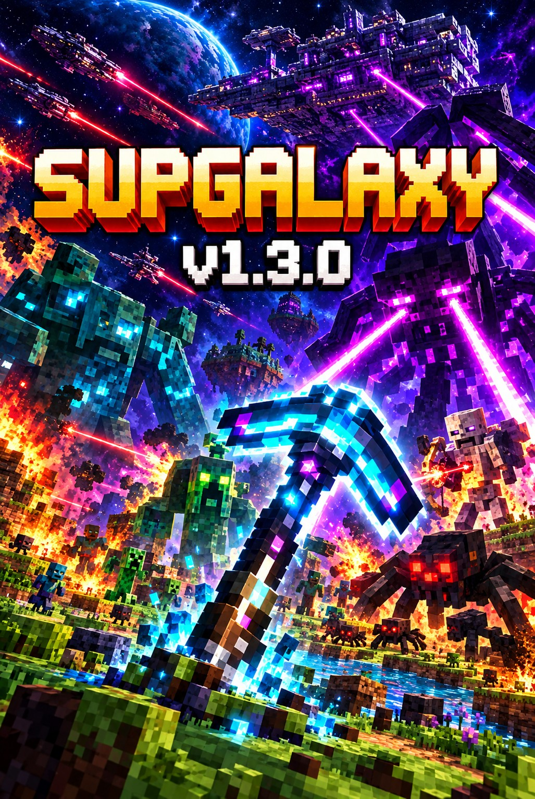

# 🌌 SupGalaxy v1.3.0



**SupGalaxy** is an open-source, serverless voxel world—**Minecraft-style gameplay fused with satoshi-grade decentralization**. Worlds generate from simple keyword seeds and sync globally through **IPFS + P2FK** on Bitcoin testnet3. No accounts. No servers. No gatekeepers. Just your browser and an infinite procedural cosmos.

Built with ❤️ by **embii4u**, **kattacomi**, **Grok (xAI)**, **Jules**, **ChatGPT** and **github CoPilot**.

> **License: CC0 (Public Domain)**  
> Use, modify, remix, or commercialize freely.  
> **Demo: https://supgalaxy.org**

---

## 🆕 What's New in v1.3.0

- **⛏ Iron & Blue Iron Picks** — real mining tools with per-block hit counts, melee damage multipliers, breakage odds and a glowing Blue Iron head (see [Mining and Picks](#-mining-and-picks)).
- **🏰 Castle building set** — doors that open and close, oak & castle-stone stairs, portcullis gates, castle bricks, battlements, limestone, roof tiles, support beams and rose stained glass (see [Building Blocks](#-building-blocks-stairs-doors--castles)).
- **👹 Level 2 mobs (score ≥ 100)** — every world type gets a new mob modelled on a different voxel game: Bone Archers (night), Dust Vultures, Crater Hoppers, Ember Drifters and Moss Brutes. Dust Vultures are the first **flying** mobs (see [Mob Evolution](#-mob-evolution--elite-mobs)).
- **🐉 Level 3 mobs (score ≥ 200)** — crawleys retire. The Sentinel Drone, Brick Golem, Magma Wyrm and Tomb Crawler arrive, but they **only fight players who are holding a laser gun or who attack them first**.
- **🗿 Level 4 titans (score ≥ 300)** — the toughest mobs yet: Ancient Guardian, Lunar Overlord, Fire Giant, Sand Tyrant and Stone Colossus. Only one per world, and they stay **peaceful until you attack them**.
- **👀 Longer player view** — other players' avatars are now drawn up to 64 blocks away (was 32).
- **🦴 Bones** — scattered under Dust Vulture roosts. Pick them up and keep them as a crafting item.
- **🔵 Blue laser rework** — one blue blast breaks any breakable block (castle bricks included). Obsidian resists and takes 4 blasts.
- **🧊 No more freeze when mobs shoot** — laser lights now come from fixed pools, and mob projectiles carry no lights, so firing no longer forces every material's shaders to recompile.
- **🔗 Sturdier multiplayer mob sync** — mobs owned by any player (not just the host) now stream their updates, shots damage mobs exactly once, and removed mobs no longer reappear from late packets.

---

## ✨ Core Features

### 🚀 Infinite Procedural Worlds
- Worlds derived from simple keyword seeds (`space`, `FLOWER🌼`, `Love`)  
- Cosmic biomes: Vulcan fields, lunar ranges, massive giants, vast deserts  
- Procedural stars, sun(s) & moon(s) per world  

### 🛠 Craft, Build, Survive
- Mine, place, craft, explore  
- Fight mobs and manage health  
- Toroidal map (wraps seamlessly at edges)  
- Streamlined inventory and crafting system  

### 🌐 Fully Decentralized Persistence
- Chunk deltas stored as JSON on **IPFS**  
- Indexes via **P2FK** (Pay-to-Future-Key) on Bitcoin testnet3  
- Optional world ownership (1-year renewable)  
- Global sync without centralized servers
- Save and reload game session via file  

### 👥 WebRTC Multiplayer + PvP
- Peer-to-peer multiplayer (TURN recommended)  
- Syncs player position, builds, and combat  
- Drag-and-drop `.json` connection files  
- PvP through left-click with knockback  

### 🪄 The Magician’s Stone
A special block capable of adding **images, video, audio and animated 3d models** into the game world.

### 🪧 The Calligraphy Stone
A special block capable of adding **colored or transparent signs with clickable web links** into the game world.

### 🧍 Custom Avatars
After login, press `V` (or the **Avatar** HUD button) to wear a custom model: paste an **objkt.com token URL** (the model is read from the token's artifact URI), `IPFS:CID`, `ipfs://` or `https://` link to a **Mixamo-rigged `.glb`/`.gltf`** or a **MagicaVoxel `.vox`**. The dialog previews the model walking on a turntable (optional wireframe look). Models are scaled to the 2-block player height. Rigged GLB/GLTF avatars use standard skeletal walking, sprinting, jumping and attack motions, starting from a neutral standing pose. After 10 seconds without moving, jumping or attacking, an embedded animation plays once as a long idle (preferring an idle-named clip, otherwise the first clip), then returns to standing. Gameplay actions immediately interrupt it; models without a skeleton use whole-model motion instead. IPFS/objkt avatars are shown to every multiplayer peer (https models stay local for privacy) and avatars are saved in session files (`profile.avatar`).

### 🎙 Proximity Video & Voice
See and hear players based on distance—natural spatial communication.

### 💬 Global Player Chat
Real-time text chat with all connected players via WebRTC. Press `/` to open chat, send messages instantly, and view chat history.

### 🎵 IPFS Music and Video Streamer
- Discovers audio and video tracks tagged `#game` across the p2fk.io network  
- Loads the 10 latest `.mp3`/`.wav`/ `.mp4`/`.avi` files  
- Includes in-game mini-player controls and saveable playlists  

---

## 🐝 Survival Ecosystem

- **Bees (Day)** — gather pollen and produce honey  
- **Honey** — restores +5 HP  
- **Night Crawlers (Night)** — hunt honey & smash hives  
- **Torches** — repel night creatures with light  
- **Red Laser Gun** — deals 5 damage per shot (no ammo needed)
- **Green Laser Gun** — deals 10 damage per shot, fires two blasts at once (consumes Emerald)
- **Blue Laser Gun** — deals 15 damage per shot, fires three blasts at once (consumes Blue Calcite, drops from UFOs)

### ⛏ Mining and Picks

Select a pick in the hotbar and **left-click** to mine or attack (mobile: ⚔ or tap).

| Block | Hands / Iron Pick | Blue Iron Pick |
|-------|-------------------|----------------|
| Grass, Moss | 1 hit | 1 hit |
| Dirt, Sand, Glass (including stained glass and glass tiles) | 2 hits | 1 hit |
| Wood, Iron Ore, Blue Calcite | 4 hits | 2 hits |
| Stone | Iron Pick only: 2 hits | 1 hit |
| Emerald | Iron Pick only: 4 hits | 2 hits |
| Dark Glass | Iron Pick only: 2 hits | 1 hit |
| Obsidian | Cannot break | 4 hits |
| Bedrock | Cannot break | Cannot break |

Other blocks retain their existing strengths; the Blue Iron Pick halves their required hits, rounded up.

- **Iron Pick:** craft with 1 Iron Ore + 1 Sand + 1 Torch + 1 Wood. Each left-click use has a **1 in 500** chance of breaking one pick; melee damage is **double** normal damage.
- **Blue Iron Pick:** upgrade with 1 Lava + 1 Iron Pick + 1 Blue Calcite. Each left-click use has a **1 in 100** chance of breaking one pick; melee damage is **triple** normal damage.
  Its glowing head lights the mining area with the same blue light as Blue Calcite, in first person, third person, and multiplayer.
- Breakage is rolled once per use, including misses and hits on protected blocks; the current swing still completes.
- **Red lasers** can mine only blocks breakable by hand. **Green lasers** can also mine Stone, Emerald, and Dark Glass, but not Obsidian. **Blue lasers** mine an area, and one blast breaks any breakable block (including castle bricks). Obsidian resists and needs 4 blasts. Bedrock and chunk ownership protections remain in effect.

### 🏰 Building Blocks: Stairs, Doors & Castles

Directional blocks (doors, stairs, portcullis) face the way your camera is looking when you place them.

| Block | Recipe | Notes |
|-------|--------|-------|
| Oak Door | 5 Wooden Planks + 1 Iron Ore → 1 | Two blocks tall. **Right-click** to open/close; it won't close on top of a player. Toggles sync in multiplayer and respect chunk ownership. |
| Oak Stairs | 6 Wooden Planks → 4 | Walk up them without jumping. |
| Castle Stone Stairs | 6 Castle Stone Bricks → 4 | Stone variant of stairs. |
| Portcullis | 4 Iron Ore + 1 Coal → 1 | See-through iron gate grid. |
| Castle Stone Bricks | 3 Stone + 1 Brick → 4 | Core castle wall block. |
| Mossy Castle Bricks | 3 Castle Stone Bricks + 1 Moss → 4 | Weathered walls. |
| Battlement Stone | 3 Castle Stone Bricks + 1 Smooth Stone → 4 | Crenellated wall tops. |
| Chiseled Limestone | 2 Marble + 1 Coal → 2 | Decorative trim. |
| Polished Limestone | 3 Smooth Stone + 1 Sand → 4 | Clean pale stone. |
| Red Roof Tile | 2 Brick + 1 Clay → 4 | Roofing. |
| Slate Roof Tile | 2 Cobblestone + 1 Coal → 4 | Roofing. |
| Oak Support Beam | 2 Wood + 2 Wooden Planks → 4 | Timber framing. |
| Rose Stained Glass | 2 Glass + 1 Flower → 2 | Tinted castle windows. |

---

## 👹 Mob Evolution & Elite Mobs

The galaxy fights back as you get stronger. Mob tiers unlock from the **highest score of any player in an area** (players within ~96 blocks of each other), so a veteran raises the danger for everyone nearby.

| Tier | Score | Effect |
|------|-------|--------|
| 1 | 0 – 99 | Classic mobs: bees, crawlers, spiders, grubs, fish, whales, UFOs |
| 2 | 100+ | One **level-2 mob** per world type joins the existing spawns (always hostile, moderate difficulty) |
| 3 | 200+ | Crawleys retire. **Level-3 heavy hitters** arrive, but they stay passive unless you are holding a laser gun (red, green or blue) or you hit them first (they hold a grudge for 30 s). |
| 4 | 300+ | **Level-4 titans** arrive: one per world, never aggressive unless you attack them (they hold a grudge for 60 s). |

You get a warning message whenever your score crosses into a new tier. Dying resets your score, and elite mobs leave once no nearby player meets their tier.

### Level 2 (score 100+)

Each mob is based on a different voxel game and borrows that game's way of fighting.

| World | Mob | Inspired by | How it fights | HP | Score | Drop |
|-------|-----|-------------|---------------|----|-------|------|
| 🌍 Earth / 🗿 Massive | **Bone Archer** *(night only)* | *Minecraft* Skeleton | Keeps about 6–15 blocks away, strafes around you and backs off if you rush it. It then draws its bow and fires **arcing arrows**. Break line of sight or close in fast. Leaves at sunrise. | 20 | 40 | Iron Ore (50%) |
| 🏜 Desert | **Dust Vulture** *(flying)* | *7 Days to Die* Vultures | The flock **circles a roost far out at the edge of the loaded map** (about 60–75 blocks away; easy to spot in third person). There are never more than **4 per world**. Get within ~26 blocks of the roost and they **dive-bomb** you for a bite, then climb away. They follow you up to ~40 blocks from the roost. **Bones** lie scattered on the ground under every roost. | 12 | 30 | 2 Bones (60%) |
| 🌙 Moon / 🌍 Earth swamps | **Crater Hopper** | *Cube World* Slime | A wobbling jelly cube. It **squashes down, then bounces at you** in long low-gravity arcs, damaging you if it lands on you. Sidestep while it's in the air. On Earth it only appears in **swamp** biomes, is green, and drops Green Crystal instead. | 10 | 25 | Blue Crystal (50%) · Green Crystal on Earth (50%) |
| 🌋 Vulcan | **Ember Drifter** | *Vintage Story* Drifter | A hunched, ash-grey shambler with a smouldering chest. It's rare, and only **notices you within 11 blocks** (it keeps chasing out to 22 once engaged). It **lobs glowing cinders** and **claws** you up close. | 14 | 25 | 2 Torches (60%) |
| 🗿 Massive | **Moss Brute** | *Hytale* Trork | A tusked, club-carrying brute. It **roars (0.85 s warning), then charges** in a straight line. Dodge sideways and it **stumbles, dazed**, for about 1.7 s. Up close it **swings its club**. | 22 | 30 | 3 Leaves (60%) |

### Level 3 (score 200+) — only hostile to armed or aggressive players

| World | Mob | Inspired by | How it fights | HP | Score | Drop |
|-------|-----|-------------|---------------|----|-------|------|
| 🌙 Moon / 🌋 Vulcan | **Sentinel Drone** *(flying, rare)* | *No Man's Sky* Sentinels | Patrols the sky. If you are armed, it **scans you with a beam** for 2 s. Once alerted it calls **one reinforcement**, circles you and fires **single energy blasts** every ~1.5–2 s. At low HP it **pulls back to repair**. At most 2 per world. | 24 | 50 | Blue Calcite (60%) |
| 🗿 Massive | **Brick Golem** | *Dragon Quest Builders* Golem | A slow, heavy brick giant. Up close it raises its arms and **ground-slams** (radius 7, telegraphed for 1.2 s). **Jump to dodge** the shockwave. At range it **hurls boulders**. | 60 | 80 | 4 Castle Stone Bricks |
| 🌋 Vulcan | **Magma Wyrm** *(aquatic)* | *Subnautica* Sea Dragon Leviathan | Lurks in **deep Vulcan water** (the only realm deep enough). It **surfaces to spit fireballs**, dives, and **lunges** with a bite when you swim close. | 45 | 70 | 2 Emerald |
| 🏜 Desert | **Tomb Crawler** *(burrowing)* | *Terraria* Tomb Crawler | Travels **under the sand** as a moving mound and can't be hit while buried. Carry a laser near it and it **erupts beneath you** in a tall arc (knock-up + damage), then dives back down. Even when calm it breaches every 6–15 s, so you can spot it. | 40 | 60 | 4 Bones |

### Level 4 (score 300+) — titans, passive until attacked

The toughest mobs yet. Each world has **at most one titan** in the whole loaded map. It spawns 40–80 blocks away (visible in third person) and ignores you until **you hit it**. Then it fights you (and only you) for 60 s.

| World | Mob | Inspired by | How it fights | HP | Score | Drop |
|-------|-----|-------------|---------------|----|-------|------|
| 🌍 Earth | **Ancient Guardian** | *Zelda: Breath of the Wild* Guardian Stalker | A six-legged dome with a single eye. It **paints you with a pink laser sight for 2.6 s** (its eye flickers faster as the lock completes), then fires a **fast beam**. Break line of sight before it fires. Up close it **stomps** (jump to dodge). | 150 | 150 | 4 Blue Calcite |
| 🌙 Moon | **Lunar Overlord** *(flying)* | *Terraria* Moon Lord | A floating eyed head with two eyed hands. It circles 12 blocks above you, alternating a **fan of 6 phantasmal bolts** from its hands with a **3-beam eye volley**. It attacks faster below half HP. | 180 | 180 | 6 Green Crystal |
| 🌋 Vulcan | **Fire Giant** | *Elden Ring* Fire Giant | A towering giant with a burning eye in its belly. It **raises a foot and stomps** a radius-9 shockwave (**jump to dodge**) and **hurls a fan of 3 flaming boulders** at range. | 200 | 200 | 6 Emerald |
| 🏜 Desert | **Sand Tyrant** | *Monster Hunter* Diablos | A horned desert wyvern. It **roars** (knock-back), then **charges horn-first** across the dunes. Up close it spins a **tail sweep**. Dodge sideways from the charge. | 170 | 170 | 10 Bones |
| 🗿 Massive | **Stone Colossus** | *Shadow of the Colossus* (Gaius) | A 9-block stone knight with a great sword. It **raises the sword for 1.6 s, then slams** it down in front of itself. It **stamps** on anyone at its feet (jump to dodge). | 220 | 220 | 12 Castle Stone Bricks |

### Wide-ranging Mobs & Despawning

Grubs (max **2**), Dust Vultures (max **4**), Sentinel Drones (max **2**) and level-4 titans (max **1**) are counted across the **whole loaded map**, not just near each player. They **don't despawn when you walk away**. They leave only when their chunk unloads from the authority's loaded (third-person viewable) map, or when no player in the world still meets their tier. Other mobs still despawn beyond ~96 blocks.

"Armed" means holding a Laser Gun, Green Laser Gun or Blue Laser Gun in the selected hotbar slot. Hitting a level-3 mob with anything (fists and picks included) also provokes it for 30 s. Level-4 titans ignore held weapons and only respond to being hit. Your held item is synced to peers, so a mob's authority sees the same thing you do.

Elite mobs are built from Three.js meshes (spheres, cylinders, cones, tori), not only voxel boxes. They have animated rigs (bow draw, slime squash-and-stretch, cinder throw, charge, rotor spin, wing flaps, slam windup, serpentine swim) and flash red when hit. Arrows, energy bolts, cinders, boulders and fireballs are real projectiles. Most arc under gravity. Elite projectiles never destroy blocks, can be blocked by walls, and carry **no dynamic lights**: adding or removing a scene light recompiles every material and caused the old Sentinel freeze. Hits spawn a small shard burst instead.

### 🦴 Bones

Bones (item ID 176) appear on the ground under Dust Vulture roosts. The roost's spawning authority keeps about 3 there and announces them to peers via `item_dropped`. Walk over a bone to pick it up. Bones are an **item-only crafting ingredient**: you can't place them, and their recipes are coming in a future update.

### Multiplayer Behaviour

- Elites use the shared mob pipeline (`mob_spawn` / `mob_update_batch` / `mob_hit` / `mob_kill` / `mob_despawn`). Only the mob's **authority** runs its AI (the area spawner, or the host as fallback). Everyone else interpolates its position and aiState, so animations match on every screen.
- Ranged attacks travel as `laser_fired_batch` projectiles. Each client checks hits **against its own player only**, so a dodge on your screen is a real dodge.
- Melee and area attacks (vulture bite, hopper squash, drifter claw, brute charge/club, wyrm lunge, golem slam, tomb-crawler eruption, titan stomps, charges and sword slams) are sent as `elite_mob_attack` messages. The host relays them by world, and each client checks its own player once, with deduplication.
- A player's projectile hit on a mob is reported **once, by the shooter**, to the mob's authority.
- Player scores and the held item ride along with `player_move` (also sent when you switch hotbar slots while standing still), so every spawner knows the area's tier and who is armed.

### Adding the Next Tier

1. Add a definition to `ELITE_MOB_TYPES` and its builder/`think`/animation code in `js/mob-evolution.js`. Fields include `archetypes`, day/night, HP, score, drop, hitbox, and the optional `provoke: "armed" | "attacked"`, `grudgeMs`, `worldMax`, `wideRange`, `biomes`, per-world `drops`, `roost` and `burrows`.
2. Append a tier to `MOB_EVOLUTION_TIERS` (e.g. `{ level: 5, minScore: 400, introduces: [...], retires: [...] }`).

---

# 🎮 How to Play

## Option 1 — **Play Online (Instant)**
👉 **https://supgalaxy.org**  
No install required. Works in Chrome/Firefox. HTTPS recommended.

---

## Option 2 — **Play Locally (ZIP Build)**  
SupGalaxy now ships as a **multi-file project**, easier for developers to modify.

### 📥 Local Setup
1. **Download the ZIP** (from GitHub Releases).  
2. **Unzip** the folder anywhere.  
3. Open the folder and **launch `index.html`** in Chrome or Firefox.  
   - Works offline 

You're in!

---

## 🔐 Security & Privacy
- **Local Execution:** For the highest level of security, running SupGalaxy locally (as described above) is recommended.
- **Client-Side Keys:** Your testnet3 wallet private keys (WIF) never leave your browser. They are encrypted and stored locally in your browser's `localStorage` (`sup_iw_v1`). All transaction signing and P2FK encoding happens entirely client-side.

---

## 🌍 World & Player Setup
- **World Name**: max 8 chars  
- **Username**: max 20 chars  
- **Seed**: auto-generated as `worldname`  

Spawn, explore, build, fight, survive.

---

## 🕹 Controls

| Action | Keyboard / Mouse | Mobile |
|--------|------------------|--------|
| Move | `WASD` | Arrow buttons |
| Jump | `Space` | `J` |
| Attack / Mine | Left-click | ⚔ |
| Place Block | Right-click | Hold |
| Select Item | Scroll | Hotbar tap |
| Toggle View | `T` | `T` |
| Avatar | `V` | HUD button |
| Craft | `R` | — |
| Teleport | `P` | — |
| Save | `X` | — |
| **Open Chat** | **`/`** | **📢 button** |

**Tips:**  
- 2 sand → 4 glass  
- +10 score per mob defeated (elite mobs: +30 to +80)  
- Players & mobs spawn in loaded chunks  
- TURN server recommended for multiplayer  
- Press `/` to open chat and talk with other players in your world  

---

# ⚔️ Multiplayer: WebRTC Signaling

There are two ways to connect with other players via WebRTC: **Automated On-Chain Signaling (Testnet3)** and **Manual Drag-and-Drop**.

## Automated On-Chain Signaling (Recommended)
When your Testnet3 wallet is unlocked, WebRTC connection files are automatically negotiated over the Bitcoin testnet3 network using IPFS and P2FK.

### Host
1. Start a world and unlock your Testnet3 wallet.
2. The game automatically monitors for incoming **offers** on your world's keyword.
3. When an offer is detected, the game automatically generates an **answer** and broadcasts it back to the client on-chain.

### Client
1. Unlock your Testnet3 wallet.
2. Open 🌐 **Switch world** → enter the host's handle under **Connect to Friend** → click **Connect to Friend**.
3. The game automatically generates an **offer**, uploads it to IPFS, and broadcasts it on-chain to the host.
4. The game monitors your personal derived keyword (`worldName@userName`) for the host's **answer**.
5. Once the answer is received, the connection is established!

## Manual Drag-and-Drop
If you are playing without a wallet, you can manually exchange connection files.

### Host
1. Start a world.  
2. Receive an **offer** file from a client (via chat, email, etc.).
3. Accept via Pending Connections or drag onto the minimap.  
4. Game creates an **answer** file.  
5. Send the answer back to the client.

### Client
1. Open 🌐 **Switch world** → enter the host's handle under **Connect to Friend** → click **Connect to Friend**.
2. Download **offer** file.  
3. Send to host.  
4. Receive **answer**.  
5. Drag it onto your minimap.

Connection established → avatars appear → PvP active.

---

# 🧩 Developer Guide

SupGalaxy is entirely browser-based—no bundlers, node modules, or build steps.

### Core Architecture
- **three.js** rendering  
- Infinite procedural chunks (16×64×16)  
- Background worker polling P2FK  
- WebRTC peer-to-peer networking  
- Simple JS modules

### Extend SupGalaxy

#### Add a Block
```js
BLOCKS[id] = {
  name: "StarBlock",
  color: "#hex",
  transparent: true
};
```

#### Add a Recipe
```js
RECIPES.push({
  id: "star",
  out: { id: 120, count: 1 },
  requires: { 4: 2 }
});
```

#### Add a Biome
```js
BIOMES.push({
  key: "nebula",
  palette: [16, 4],
  heightScale: 2.0,
  roughness: 0.7,
  featureDensity: 0.01
});
```

#### Multiplayer Hooks
- Position sync via `user_update`  
- Avatar rendering through `userPositions`  
- TURN server strongly recommended  

#### IPFS Block Versioning
SupGalaxy uses a **truncated unix date** system to ensure block updates from IPFS remain in correct chronological order:

- **BlockDate from Blockchain**: When chunks are published to the blockchain via IPFS, they receive a BlockDate from the transaction. This BlockDate is returned by GetPublicMessagesByAddress when loading chunks by keyword search.
- **Truncated Unix Date**: Seconds since 2025-09-21 00:00:00 UTC (custom epoch). This provides a compact integer for versioning.
- **Monotonic Ordering**: Block updates are only accepted if they have a strictly newer (larger) truncated unix date than any existing update.
- **Out-of-Order Protection**: If IPFS files arrive or are processed out of order, older updates are automatically skipped.

Helper functions:
```js
// Compute truncated date from a BlockDate timestamp (in milliseconds)
const truncated = computeIpfsTruncatedDate(blockTimestampMs);

// Check if an IPFS update should be applied (returns true if incoming > existing)
if (shouldApplyIpfsUpdate(existingTruncated, incomingTruncated)) {
  // Apply the update
}
```

Run tests in the browser console: `runIpfsVersioningTests()`

### Large Magician’s Stone models

Model dimensions and download size are not triangle counts. A 64 × 128 placement does not
subdivide the artwork, but standing on a dense mesh previously triggered repeated full
triangle scans and five ground raycasts every frame.

- GLB/glTF stone collision is prepared as a triangle BVH in a dedicated Blob worker,
  compatible with both opening `index.html` directly (`file://`) and HTTP(S) hosting.
  Its self-contained builder loads before the collider script; no worker script fetch
  from a file origin is required. Worker Blob URLs are released on success, failure
  or cancellation. Geometry
  extraction yields between batches; original rendering buffers are not transferred or
  detached. Collision becomes active only when preparation is ready. Failed preparation
  leaves collision disabled with a warning, never an expensive unindexed fallback.
  GLTF parsing, image decoding and first GPU uploads still have browser/main-thread costs;
  worker-built collision does not guarantee a stall-free import of arbitrary assets.
- In **3D model performance**, an optional simplified collider URL accepts the same
  IPFS/objkt/HTTPS sources as the visual model. Export it in the visual model’s original
  coordinate system; the visual model’s scale, centering, offsets and orientation apply
  to both. The collider is not rendered. Use real surface geometry for slopes, holes,
  stairs and overhangs, not one bounding box.
- **Frozen import-pose surface** explicitly snapshots collision geometry, including
  skinned/morph geometry, at import. Animations do not move the collider. Use a separate
  static collider or **No collision** where animated surfaces would be misleading.
- Optional texture limits (512/1024/2048 pixels) reduce eligible image textures while
  preserving aspect ratio. Data, compressed, cube and video textures remain unchanged.
  **Original**, unlimited render distance and **Always** animation preserve existing
  visual behavior. Nearby/view-only animation pauses rather than catching up offscreen.
  View/distance policies use the visual model’s import-pose bounds.
- For fewer rendered triangles, supply a lower-detail GLB in the main URL field. This
  does not automatically simplify artwork or add LOD assets. Draco/Meshopt/KTX2 decoder
  integration is not included; compression alone does not reduce rendered triangles.
- Collider and quality settings survive world/session saves and multiplayer sync.

#### Compare CPU collision and rendering cost

In a safe, quiet world, use third-person view to include the imported avatar’s render
cost. Keep the camera and player still, wait for collision preparation and texture uploads,
then record Chrome DevTools **Performance** while running:

```js
const nearby = await compareModelPerformance({ label: 'nearby', seconds: 5 });
// Stand on the model and repeat:
const onTop = await compareModelPerformance({ label: 'on-top', seconds: 5 });
```

Each comparison collects eight local-only combinations of collision on/off, imported/default
local avatar and stone animation on/off. Player pose is held between physics updates so
collision-off samples do not fall through the model. Existing animation settings still
apply; enable stone animation first for a meaningful animation comparison. Enable stone
collision first as well: profiling does not override a saved no-collision setting. Remote avatars
are unchanged. No diagnostic switches are persisted or sent to peers.

Reports include mean/p95 frame time, FPS, body/ground query timings and counts, draw calls,
triangles and renderer geometry/texture counts. The browser trace contains a named capture
range. `renderCpuMs` measures CPU render submission, **not GPU time**; renderer memory counts
are **not bytes**. Keep reports with the device/browser and model used; headless/synthetic
measurements cannot establish FPS on the linked NFT and avatar.

For one sample, use `await startModelPerformanceCapture({ label: 'on-top', seconds: 5,
collision: false, avatar: 'default', animation: false })`.
`stopModelPerformanceCapture()` stops early and restores overrides; world changes or
player death abort the sample. Captures are capped at 60 seconds/3,600 sampled frames.
The documented `runStoneCollisionTests()` console command checks the indexed collision
implementation without requiring an external model, including multistory tower floors,
walls, stairwell openings and step-up surfaces. Run it both from a directly opened
`index.html` and from HTTP hosting to check worker-startup compatibility.
`await runStoneCollisionTests({ benchmark: true })` also compares the old scans against
the BVH on a synthetic 180,000-triangle terrain fixture, reporting separately measured
triangle/node candidate counts and query timings. It deliberately runs expensive reference
scans on the main thread; run it separately from gameplay FPS captures.

---

# 👛 Testnet3 Wallet Integration

SupGalaxy includes a built-in Bitcoin testnet3 wallet (`js/wallet.js`) to handle P2FK messaging and decentralized persistence.

### Wallet Functions
- **Login & Unlock:** You can generate a new testnet3 address or import an existing WIF (Wallet Import Format) private key. Your wallet is protected by a password and stored securely in your browser's local storage.
- **Saving to Testnet3:** Game state and chunks are uploaded to IPFS (via `p2fk.io`), and the resulting URN is broadcasted on-chain using P2FK messages from your wallet.
- **Consolidate Funds:** The wallet includes tools to consolidate funds from change addresses back to your main address (`consolidateChange()`) or prepare funds specifically for messaging (`consolidateForMessaging()`).
- **Export WIF:** You can easily export your private key at any time to back it up or use it in other Sup!? sister projects (like SupSpace or SupRadio).

All exported wallet functions (`generateKey`, `importWallet`, `unlockWallet`, `exportWif`, `consolidateChange`, `sendManyWithWallet`, `signWithWallet`, etc.) are globally accessible via the `window` object for seamless integration with the game logic.

---

# 🌐 Local Decentralized Setup (Advanced)

Run your own **Sup!?** + **p2fk.io** stack for full independence.

### Requirements
- Windows  
- ~260 GB free (Bitcoin testnet3)  
- .NET 8.0+  
- Fast SSD  

### 1. Install & Sync Sup!?
- Extract `Supv0.7.6-beta` to `C:\SUP`  
- Launch `SUP.exe`  
- Enable **testnet**  
- Sync (1–2 days)

### 1.5 Configure Custom IPFS Root (Optional)

By default, SupGalaxy looks for local IPFS files in `C:/Sup/ipfs` when running in Sup!? local mode (with `transactionid` parameter). You can override this location using the `ipfs-path` URL parameter:

**Examples:**
```
# Use default C:/Sup/ipfs
http://127.0.0.1:8080/?transactionid=ABCD

# Use custom Windows path
http://127.0.0.1:8080/?transactionid=ABCD&ipfs-path=D:/MyIPFS

# Use custom Unix path  
http://127.0.0.1:8080/?transactionid=ABCD&ipfs-path=/home/user/ipfs
```

**Note:** The path should use forward slashes (`/`) even on Windows for proper `file:///` URL construction.
  

### 2. Run Local p2fk.io API

Edit `Wrapper.cs`:

```csharp
public string TestCLIPath = @"C:\SUP\SUP.exe";
public string TestVersionByte = @"111";
public string TestRPCURL = @"http://127.0.0.1:18332";
public string TestRPCUser = "good-user";
public string TestRPCPassword = "better-password";
```

Start API → http://localhost:5000

### 3. Point SupGalaxy to Your API
Search/replace `https://p2fk.io` with your local endpoint.

### 4. Etch Saves
Export JSON from the game → publish using Sup!? → peers sync automatically.

---

# 🆚 SupGalaxy vs. Traditional Voxel Games

| Feature | SupGalaxy | Traditional |
|--------|-----------|-------------|
| Worlds | Infinite | Finite / server-bound |
| Persistence | On-chain (IPFS + BTC) | Central servers |
| Multiplayer | WebRTC P2P | Hosted servers |
| Ownership | Player-controlled | Company-owned |
| Licensing | **CC0** | Proprietary |

---

# 🤝 Join the Cosmos
- **Play**: https://supgalaxy.org  
- **Contribute**: Pull requests welcome  
- **Community**: Join **#HugPuddle** on Sup!?  
- **Contact**: @embii4u on Sup!?  

**SupGalaxy: A gift to the world. Build freely. Explore infinitely.** ✨
